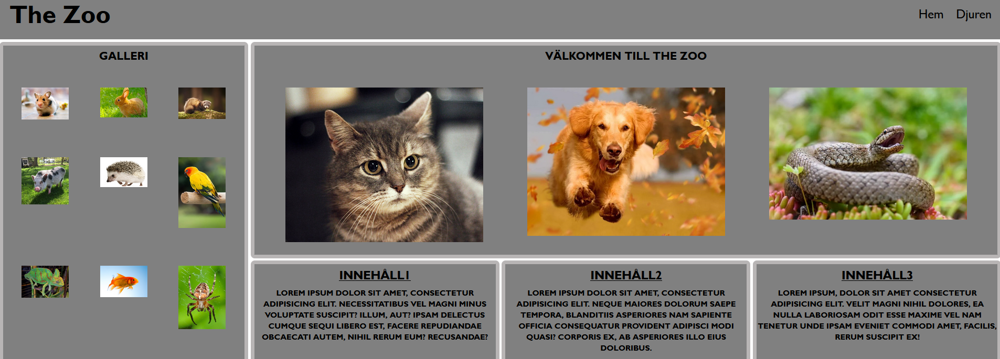
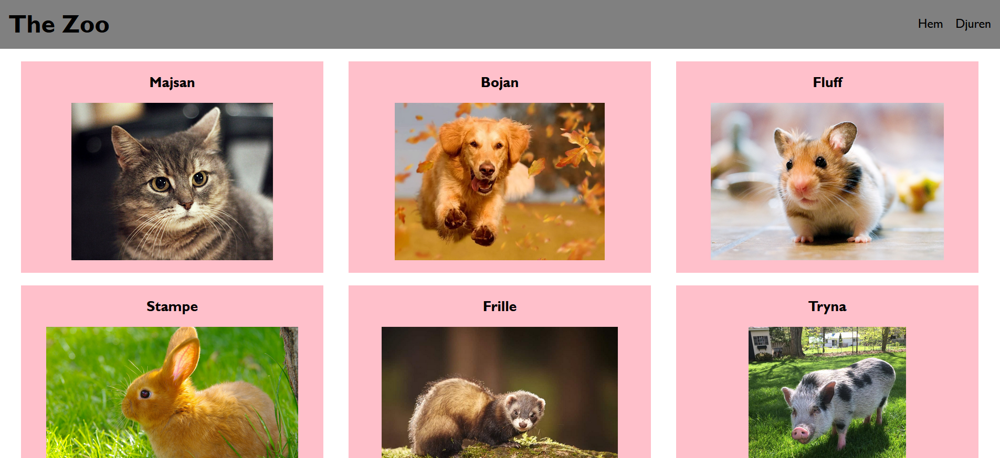
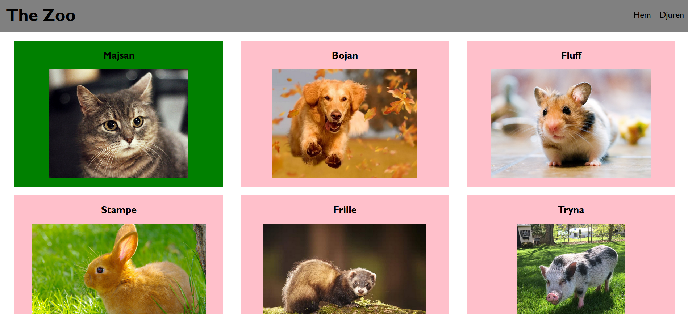
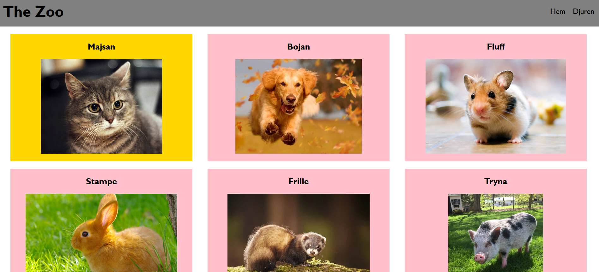

## Hi, im Rebecca!

👩🏻‍🎓 I am currently studying web development with a focus on e-commerce at Medieinstitutet in Stockholm, Sweden. 
🧩 My hobbies include swimming, walking, and reading. 

[My Portfolio](https://zoromino.github.io/Portfolio/)

 
💻 Tech Stack 

 
 
 
 

 

 
💻 The technology I'm currently learning about! 

 

 

[the-zoo-projekt](https://github.com/Zoromino/the-zoo-Zoromino-main)

-> From the zoo project, the zoo with many different animals that need to be fed!
 
-> When you find an animal you want to feed (marked red if hungry), click on its profile to access the feeding button. Clicking the button will turn the animal’s picture green, indicating that it has been fed and cannot be fed again until it turns red (hungry) once more.
 
-> After feeding, the animal’s picture turns green to show it has been fed. It cannot be fed again until its picture turns red. The picture will turn yellow when it’s almost time to feed again.
 

